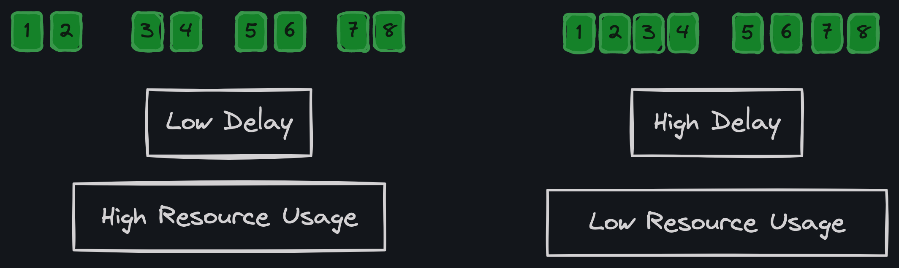

# About me

󱔟 Alex Sergeyev

 Sr. Technical Lead @HiQ

 github.com/alexsergeyev

󰌻 linkedin.com/in/alexsergeyev

---

# Agenda

| Step        | Info                       |
| ----------- | -------------------------- |
|  Own       | Firmware Development       |
| 󱤆 Sustain   | Device Longevity           |
|  Buffer    | Communication Reliability  |
| 󱡠 Batch     | Data Efficiency            |
| 󰑪 Route     | Network Flexibility        |
| 󰚰 Rollout   | Firmware Releases          |
| 󱤘 Scatter   | Network Traffic Management |
| 󰨇 Monitor   | Connectivity Metrics       |
| 󰒃 Secure    | Data Security Essentials   |
| 󱡷 Diversify | Vendor Strategy            |

---

# Own. Firmware Development

1. Firmware is more than code; it's about understanding the `device ecosystem`.
1. Internal know-how is crucial for navigating challenges.
1. Ignoring firmware management hides vulnerabilities
1. Prioritize in-house expertise to secure control and adaptability.

---

# Sustain. Device Longevity

1. IoT devices often outlive their expected lifespans
1. Plan for long-term support and maintenance. Repair and reuse are more sustainable than replacement.
1. Replacement can be very costly and time-consuming.

---

# Buffer. Communication Reliability

1. Save Data Locally: Avoid losing data when the network's down by storing it in a local buffer.
1. Reduce Network Load: Group and compress data before sending to ease network traffic.
1. Decouple sampling and data transfer
1. Local buffer simplifies gateway implementation
1. Edge processing

---

# Batch. Data Efficiency

1. A batch with multiple measurements can be better optimized for compression and transmission.
1. Processing events is more efficient when working with bigger chunks of data.
1. Implement a dynamic batch window to balance between latency and efficiency.

---

# Route. Network Flexibility

Use DNS to route devices based on their unique identifiers.

| DNS Record           | Type  | Value             |
| -------------------- | ----- | ----------------- |
| `*.gw.iot.dev`       | CNAME | `default.iot.dev` |
| `DEVICE1.gw.iot.dev` | A     | `1.1.1.100`       |

<!-- pause -->

### Benefits:

- Keep data in specific regions (US, EU, etc.)
- Move devices between different clusters (production, staging, etc.)
- Can redirect the device to the local gateway for debugging
- Easy to automate (AWS Route53, etc.)

---

# Rollout. Phased Firmware Releases

### Rollout Phases:

| Timeline       | Phase     | Coverage | Type                   |
| -------------- | --------- | -------- | ---------------------- |
| -              | Test      | <10      | Dedicated test devices |
| After 1-2 days | Canary    | 5%       | Early adopters         |
| After 1 week   | Expansion | 10%      | Random selection       |
| After 2 weeks  | Complete  | 100%     | All devices            |

<!-- pause -->

### Rollout Process:

- Monitor and adjust based on feedback and issues.
- Reset timeline if issues are found.
- Plan upgrades for devices that have been inactive for a long time
- Link user feedback and metrics to device firmware versions

---

# Scatter. Network Traffic Management

- Desynchronize communication schedules (Example: `45 + random(30)`)
- Use exponential backoff for retries. Avoid DDOSing your servers after a network outage.
- Keep in mind keep-alive and session timeouts (4G, Load balancers, etc.)

---

# Monitor. Connectivity Metrics

### Metrics:

- Connection Drop Frequency
- Device Online Status
- Traffic Analysis
- Latency Insights

<!-- pause -->

### Tags:

- Network Operator
- Firmware Version
- Hardware Model

<!-- pause -->

### Actions:

- Define thresholds for alerts and actions
- Compare metrics across different device groups (tags)
- Anomaly detection
- Trend analysis (long-term performance changes or degradation)

---

# Secure. Data Security Essentials

- Begin with the security model `before` hardware and communication protocol choices are made.
- Use well-known encryption standards (TLS 1.2/1.3) backed by hardware support (TrustZone, etc.)
- Plan strategy for secure storage of sensitive information (certificates, etc.), including the `manufacturing` process.
- No shared secrets, hardcoded keys, or "development only" backdoors.
- Firmware signing and verification. Secure boot.
- Certificate revocation and rotation
- 3rd party security audits

---

# Diversify. Supply Chain Strategy

- Multiple vendors for critical components (SoC, 4G/5G, SIM cards, etc.)
- Portability of firmware across different hardware platforms
- Avoid vendor lock-in for cloud services

---

# Team. Build a Strong Team

- People are the most critical part of the IoT ecosystem.
- Invest in training and professional development.
- Encourage open communication and feedback.
- Have fun!

---

# Thank you!

Slides: [github.com/alexsergeyev/iotmeetup](https://github.com/alexsergeyev/iotmeetup)
